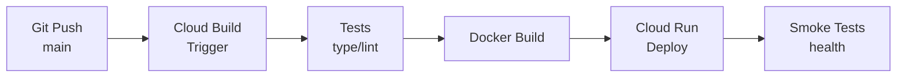

# UI Platform Executive Overview

## Executive Summary

UI Platform is a **monorepo for low-data web applications** designed specifically for **African users** where mobile data has a direct monetary cost. Every kilobyte downloaded represents real money spent by users.

The platform runs on **Google Cloud Run** (europe-west1 region) with a scale-to-zero architecture that minimizes operational costs while maximizing perceived performance under poor connectivity conditions.

---

## Architecture Overview

### Monorepo Structure

```
UI_platform/
├── apps/           # Independent applications
│   ├── web/        # AI4Startups showcase website
│   └── ai4su/      # Design OS application
├── packages/       # Shared code
│   ├── ui/         # Shared components (shadcn/ui)
│   ├── config/     # TypeScript, Tailwind, ESLint configs
│   ├── types/      # Shared TypeScript types
│   ├── utils/      # Shared utilities
│   └── infra/      # Dockerfiles, deployment scripts
```

### Tech Stack

| Layer | Technology | Purpose |
|-------|------------|---------|
| **Monorepo** | Bun workspaces | Native dependency management |
| **Framework** | Vite / React 19 (ai4su) | SPA |
| **Language** | TypeScript | Type safety |
| **Styling** | Tailwind CSS | Utility-first CSS |
| **Components** | shadcn/ui | Accessible, customizable UI |
| **Runtime** | Bun | Fast JavaScript runtime |
| **Deployment** | Google Cloud Run | Serverless containers |

### Current Applications

| App | Description | Status |
|-----|-------------|--------|
| `web` | AI4Startups showcase | Production |
| `ai4su` | Design OS tool | Development |

---

## Core Principles

Five non-negotiable principles guide all development decisions:

| Principle | What It Means |
|-----------|---------------|
| **Bytes are money** | Every kilobyte costs users real money. Optimize for value per megabyte. |
| **Perceived speed > raw speed** | Always show something immediately. Skeletons and cached data are mandatory. |
| **Scale-to-zero by default** | No always-on servers. Pay only for actual usage. |
| **Async by default** | Heavy work never blocks user requests. Use queues and background jobs. |
| **Offline-first mindset** | Assume intermittent connectivity. Cache reads, queue writes. |

---

## CI/CD Executive Summary

### How It Works

Push code to `main` branch → automatic deployment to production.



### Pipeline Steps

| Step | Duration | What Happens |
|------|----------|--------------|
| **1. Tests** | ~1-2 min | TypeScript type checking (lint disabled, TODO to re-enable) |
| **2. Build** | ~3-5 min | Docker image with layer caching |
| **3. Deploy** | ~1-2 min | Cloud Run deployment with version tag |
| **4. Verify** | ~30 sec | Smoke tests confirm deployment |

### Environments

| Environment | Branch | Purpose |
|-------------|--------|---------|
| Production | `main` | Live user traffic |
| Staging | `staging/*` | Pre-release testing |

### Rollback

Every deployment creates a tagged revision. Instant rollback via:
```bash
gcloud run services update-traffic ui-platform-web --to-revisions=PREVIOUS_REVISION=100
```

### Service URL

**Production:** https://ui-platform-web-hs6gi2nj7a-ew.a.run.app

---

## Key Metrics & Targets

| Metric | Target | Rationale |
|--------|--------|-----------|
| **Bundle size** | <200KB per app | Minimize data costs |
| **Load time (3G)** | <3 seconds | Usable on slow networks |
| **Monthly cloud cost** | <$500 until $5k MRR | Cost-efficient scaling |
| **Min instances** | 0 (scale-to-zero) | No idle charges |
| **Cold start** | <2 seconds | Acceptable for scale-to-zero |

### Cost Estimates

| Scenario | Monthly Cost |
|----------|--------------|
| Idle (no traffic) | $0 |
| Low traffic (<10k requests/day) | $5-15 |
| Moderate traffic | $35-50 |
| High traffic (constantly active) | $100-150 |

Build costs covered by free tier (120 build-minutes/day).

---

## GCP Project Details

| Setting | Value |
|---------|-------|
| Project ID | `digital-africa-ai4su` |
| Region | `europe-west1` |
| Build trigger | `ui-platform-production-deploy` |
| Service account | `ai4su-aiplatform@digital-africa-ai4su.iam.gserviceaccount.com` |

---

## Quick Reference

### Deploy Manually
```bash
gcloud builds submit --config=packages/infra/cloudbuild-cicd.yaml
```

### Check Build Status
```bash
gcloud builds list --region=europe-west1 --limit=5
```

### Smoke Test
```bash
curl -s -o /dev/null -w "%{http_code}" https://ui-platform-web-hs6gi2nj7a-ew.a.run.app
```

---

*Last updated: 2026-01-26*
